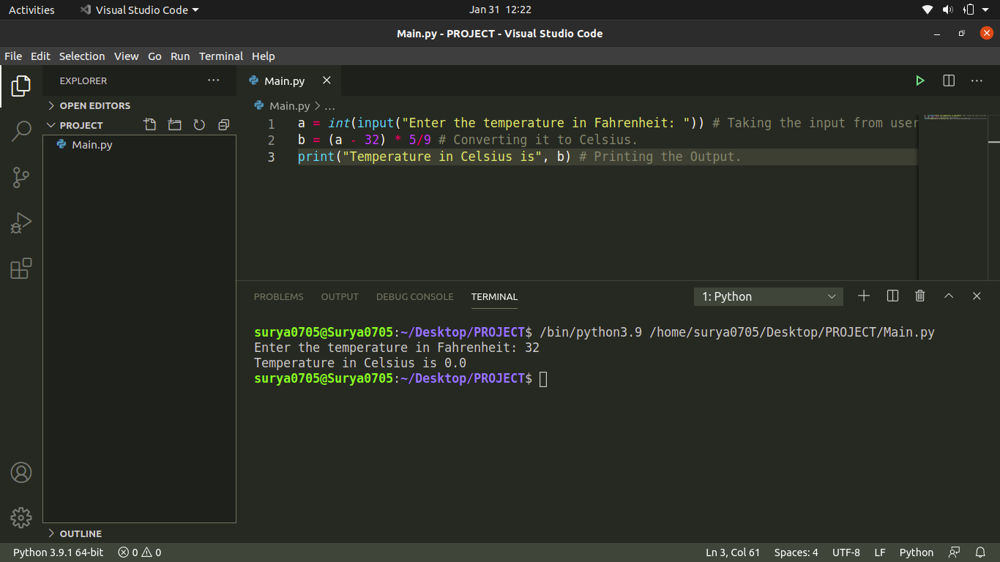

# Fahrenheit_to_Celsius
This Program converts the Fahrenheit temperature to the Celsius temperature. It is a very basic and simple Program and uses a basic Mathematics Equation to do so. Below is a Screenshot of my Program:

Hope that you liked it.
